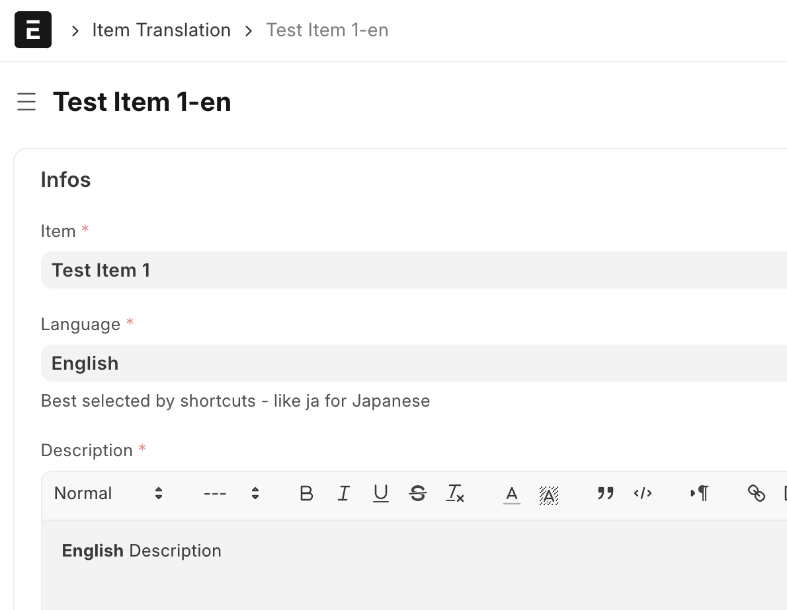
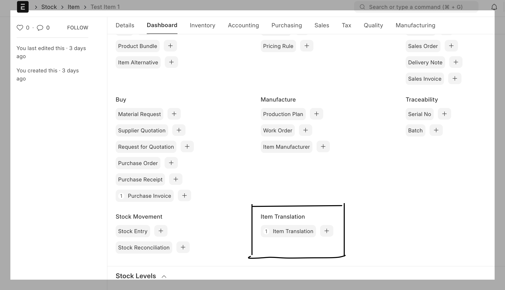
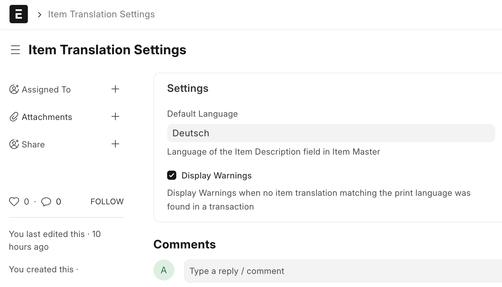

## Item Translation

Create Translations for Item Descriptions and fetch them in Selling Transactions.

### Added Doctypes:

- **Item Translation**, linked to item

- **Item Translation Settings**, for Default Language and Display of Notifications

### How it works:

Alternative Item Descriptions for different languages are stored in Item Translations.
If the print language in a supported transaction does not match the Default Language, Alternative Descriptions are fetched.
Frontend only.

### Supported transactions

- **Sales Invoice**
- **Quotation**
- **Sales Order**
- **Delivery Note**
- **Purchase Order**
- **Purchase Invoice**

### Dependencies

- Frappe
- ERPNext

Tested with ERPNext Version 15

#### License

gpl-3.0
